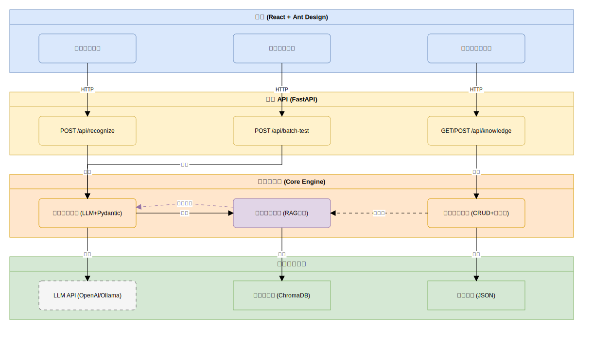

# 网络安全资产指纹识别系统

基于大模型与 RAG 技术的网络安全资产指纹识别原型系统，解决传统正则规则在非标准 Banner 识别、新漏洞快速适配、企业自研组件覆盖等方面的痛点。

## 一、项目概述

系统采用前后端分离架构：后端使用 Python 和 FastAPI 提供 RESTful API，前端使用 React + Ant Design 构建交互界面，ChromaDB 作为向量数据库。指纹识别由 LLM 直接完成语义分析，RAG 的作用是在识别完成后检索知识库中的漏洞情报、应急 SOP 等关联知识，为识别结果补充安全上下文。同时支持知识热更新，插入新知识后无需重启服务即可生效。

**核心流程：**



## 二、技术选型

| 类别 | 技术选型 | 说明 |
| --- | --- | --- |
| 编程语言 | Python 3.10+ | 生态丰富，LLM SDK 支持完善 |
| 后端框架 | FastAPI + Uvicorn | 高性能异步 API 框架，自带接口文档 |
| 大模型 | OpenAI API / DeepSeek / Ollama | 支持多种模型，通过环境变量切换 |
| 向量数据库 | ChromaDB | 轻量级，本地持久化，无需额外服务 |
| 数据校验 | Pydantic v2 | 类型安全，自动校验+修正 |
| Embedding | sentence-transformers (本地) | 本地 Embedding 无需 API 调用，离线可用 |
| 前端框架 | React 18 + TypeScript + Ant Design 5 | 组件库丰富，暗色科技风主题 |
| 图表 | @ant-design/charts | 批量测试准确率柱状图对比 |
| 知识存储 | JSON 文件 + ChromaDB | JSON 存元数据，ChromaDB 存向量 |
| 日志系统 | Python logging + TimedRotatingFileHandler | 控制台彩色 + 文件按天轮转保留 30 天 |

## 三、项目目录结构

```
web-secure-agent/
├── backend/                        # 后端（FastAPI）
│   ├── main.py                     # FastAPI 主入口
│   ├── config.py                   # 配置管理（模型、路径等）
│   ├── requirements.txt            # Python 依赖
│   ├── .env.example                # 环境变量模板
│   │
│   ├── api/                        # API 路由层
│   │   ├── __init__.py
│   │   ├── recognize.py            # POST /api/recognize 指纹识别接口
│   │   ├── batch_test.py           # GET /api/batch-test/run 批量测试接口
│   │   └── knowledge.py            # CRUD /api/knowledge 知识库管理接口
│   │
│   ├── core/                       # 核心服务层
│   │   ├── __init__.py
│   │   ├── models.py               # Pydantic 数据模型
│   │   ├── fingerprint_engine.py   # 指纹识别引擎
│   │   ├── rag_engine.py           # RAG 检索引擎
│   │   └── knowledge_manager.py    # 知识管理服务（CRUD + 热更新）
│   │
│   ├── utils/                      # 工具模块
│   │   ├── __init__.py
│   │   ├── llm_client.py           # LLM API 封装
│   │   ├── evaluator.py            # 评估器（准确率计算）
│   │   └── logger.py               # 统一日志模块
│   │
│   ├── data/                       # 数据目录
│   │   ├── knowledge_base.json     # 知识库元数据存储
│   │   ├── test_banners.json       # 测试 Banner 数据集（含标注）
│   │   └── chroma_db/              # ChromaDB 持久化目录
│   │
│   └── logs/                       # 日志目录（自动生成）
│       └── app.log                 # 按天轮转的日志文件
│
├── frontend/                       # 前端（React + Ant Design）
│   ├── package.json
│   ├── vite.config.ts              # Vite 构建配置
│   ├── index.html
│   ├── src/
│   │   ├── main.tsx                # React 入口（暗色主题 ConfigProvider）
│   │   ├── index.css               # 全局样式（暗色滚动条/动画/JSON高亮）
│   │   ├── App.tsx                 # 主应用组件（路由+渐变侧边栏+状态灯）
│   │   ├── api/
│   │   │   └── index.ts            # axios 实例 + 接口定义
│   │   └── pages/
│   │       ├── SingleRecognize.tsx # 单条识别（进度条+JSON高亮+知识时间线）
│   │       ├── BatchTest.tsx       # 批量测试（柱状图+统计卡片+逐条对比）
│   │       └── KnowledgeManage.tsx # 知识库管理（统计卡片+状态切换）
│   └── tsconfig.json
│
└── README.md
```

## 四、环境准备与依赖安装

### 4.1 安装 Python 3.10+

```bash
# macOS（通过 Homebrew）
brew install python@3.12
python3 --version  # 应输出 Python 3.12.x

# Windows
# 从 https://www.python.org/downloads/ 下载，安装时勾选 "Add Python to PATH"
winget install Python.Python.3.12
```

### 4.2 安装 Node.js 22+

```bash
# macOS（通过 Homebrew）
brew install node@22
node --version  # 应输出 v22.x.x

# 或通过 nvm（推荐）
curl -o- https://raw.githubusercontent.com/nvm-sh/nvm/v0.39.7/install.sh | bash
source ~/.zshrc
nvm install 22 && nvm use 22 && nvm alias default 22
```

### 4.3 安装 Ollama（可选，用于本地大模型）

如果不想使用 OpenAI/DeepSeek API，可以安装 Ollama 在本地运行大模型：

```bash
brew install ollama          # macOS
ollama serve                 # 启动服务
ollama pull qwen2.5:7b       # 下载模型（约 4.7GB）
```

### 4.4 后端项目初始化

```bash
cd backend
python3 -m venv venv
source venv/bin/activate      # Windows: venv\Scripts\activate
pip install --upgrade pip
pip install -r requirements.txt

# 验证安装
python -c "import fastapi; import chromadb; import sentence_transformers; print('后端依赖安装成功')"
```

**backend/requirements.txt：**

```
fastapi==0.115.0
uvicorn==0.30.0
openai==1.50.0
pydantic==2.9.0
chromadb==0.5.5
sentence-transformers==3.1.0
python-dotenv==1.0.1
numpy==1.26.0
python-multipart==0.0.9
```

### 4.5 前端项目初始化

```bash
cd frontend
npm install
npm run dev   # 看到 "Local: http://localhost:5173/" 即成功
```

**前端核心依赖：**

| 依赖名 | 用途 |
| --- | --- |
| react / react-dom | React 核心库 |
| antd | Ant Design 5 组件库 |
| @ant-design/icons | Ant Design 图标库 |
| @ant-design/charts | 图表库（柱状图对比） |
| axios | HTTP 请求库 |
| vite | 前端构建工具 |
| typescript | TypeScript 语言支持 |

### 4.6 环境变量配置

在后端目录创建 `.env` 文件（参考 `.env.example`）：

```bash
# 方式一：DeepSeek API（推荐，免费）
LLM_PROVIDER=openai
OPENAI_API_KEY=sk-your-deepseek-key
OPENAI_BASE_URL=https://api.deepseek.com/v1
LLM_MODEL=deepseek-chat

# 方式二：OpenAI API
# OPENAI_BASE_URL=https://api.openai.com/v1
# LLM_MODEL=gpt-4o-mini

# 方式三：本地 Ollama
# LLM_PROVIDER=ollama
# OLLAMA_BASE_URL=http://localhost:11434/v1
# LLM_MODEL=qwen2.5:7b

# ChromaDB 持久化路径
CHROMA_DB_PATH=./data/chroma_db
```

## 五、核心模块设计

### 5.1 配置模块 (config.py)

集中管理所有配置项，从 `.env` 文件读取环境变量，提供全局 `config` 实例。包含 LLM 配置（Provider、API Key、Base URL、Model）、Embedding 配置、路径配置和 RAG 参数（Top-K）。

### 5.2 数据模型 (core/models.py)

使用 Pydantic v2 定义标准化的数据结构，内置校验与自动修正机制。

**AssetFingerprint** — 标准化资产指纹输出，字段包括 service（服务名，自动小写化）、version、os、port、confidence（0-1，自动截断）、raw_banner。内置 `field_validator` 在 LLM 输出不规范时自动修正。

**KnowledgeEntry** — 知识库条目，字段包括 id、type（fingerprint/vulnerability/sop）、title、content、source、confidence、status（active/inactive）、tags。

**FingerprintResult** — 识别结果，包含 fingerprint 和 RAG 检索到的 matched_knowledge。

### 5.3 LLM 客户端 (utils/llm_client.py)

统一封装 LLM 调用逻辑，通过 `get_llm_client()` 根据 `LLM_PROVIDER` 环境变量自动选择 OpenAI/DeepSeek 或 Ollama 客户端。`chat_completion()` 函数封装消息构造和调用，记录调用耗时和 token 用量日志。

### 5.4 知识关联引擎 (core/rag_engine.py)

基于 ChromaDB 构建向量知识库。RAG 在本系统中的定位不是辅助指纹识别，而是在识别出资产指纹后，检索知识库中与该资产相关的漏洞情报、应急 SOP、合规基线等知识，为识别结果补充安全上下文。

核心方法：

- `_embed(text)` — 使用 sentence-transformers 生成本地向量
- `add_knowledge(entry)` — 向 ChromaDB 添加知识条目（title + content 拼接后向量化）
- `delete_knowledge(id)` — 从 ChromaDB 删除
- `search(query, top_k)` — 语义检索，过滤 `status=active`
- `build_context(matched)` — 将检索结果构建为 Prompt 上下文（预留优化）
- `get_all_count()` — 获取条目总数

### 5.5 向量数据库设计

**Collection 划分** — 单个 collection 存储全部三类知识，用 metadata 中的 type 字段过滤。避免跨 collection 查询后再合并的开销。

**Embedding 策略** — 存入时将 title 和 content 拼接后整体向量化，既有关键词匹配能力又有语义匹配能力。检索时使用 LLM 识别后的指纹关键词（如 "redis 7.2.3"）而非原始 Banner 文本作为 query。

**Metadata Schema：**

| 字段 | 类型 | 用途 |
| --- | --- | --- |
| type | string | 知识类型：fingerprint / vulnerability / sop |
| title | string | 知识标题，用于前端展示 |
| source | string | 知识来源标记 |
| confidence | float | 知识置信度，可用于结果排序 |
| status | string | active / inactive，用于软删除 |
| created_at | string | 创建时间戳（ISO 格式） |

**相似度度量** — 使用余弦相似度（cosine similarity），Top-K 设为 3，通过 `config.RAG_TOP_K` 可调整。

**去重与更新** — ChromaDB add 在 id 已存在时会报错，用 try-except 跳过。更新采用"先删后加"策略。status 字段用于软删除，硬删除仅在用户明确操作时执行。

### 5.6 指纹识别引擎 (core/fingerprint_engine.py)

系统核心调度器，接收原始 Banner 文本，直接调用 LLM 进行语义分析，输出标准化的资产指纹 JSON，并内置格式自动修正机制。识别完成后，将指纹结果交给 RAG 引擎检索关联知识一并返回。

**Prompt 模板 — 指纹识别：**

```
你是网络安全资产指纹识别专家。
根据给定的网络Banner文本，识别出资产的标准化指纹信息。

输出要求：
1. 必须输出合法JSON，字段包括：service, version, os, port, confidence, raw_banner
2. service: 服务名称（小写），如 nginx, apache, openssh, mysql, redis
3. version: 版本号（如有），无则为null
4. os: 操作系统（如能判断），无则为null
5. port: 端口号（如能从Banner中提取），无则为null
6. confidence: 置信度0-1，表示你对识别结果的把握程度
7. raw_banner: 原始Banner文本

如果Banner被伪装或格式非标准，请尽力根据语义推断真实服务。
只输出JSON，不要输出其他内容。
```

**Prompt 模板 — 知识辅助识别（可选，用于自研组件等场景）：**

```
你是网络安全资产指纹识别专家。
根据给定的网络Banner文本和参考知识库信息，识别出资产的标准化指纹信息。

参考知识库（请优先参考这些知识进行识别）：
{rag_context}

输出要求：同上
如果Banner被伪装或格式非标准，请结合知识库信息尽力推断真实服务。
只输出JSON，不要输出其他内容。
```

**识别流程：**

1. 直接调用 LLM（使用 System Prompt）
2. 解析 LLM 输出，通过 `_parse_and_fix` 做格式修正（多层兜底）
3. 用识别结果（如 "redis 7.2.3"）调用 `rag.search` 检索关联知识
4. 打包返回 `FingerprintResult`

**格式修正链（多层兜底）：**

1. 尝试直接 `json.loads`
2. 失败则去掉 markdown 代码块标记再解析
3. 仍失败则正则提取第一个 `{` 到最后一个 `}` 之间的内容再解析
4. 补全缺失字段（service 默认 "unknown"，confidence 默认 0.5）
5. 交给 `AssetFingerprint` 做 Pydantic 校验（置信度截断、服务名小写化等）

**纯正则方案** — 预定义 6 条正则规则（nginx/apache/openssh/mysql/redis/postgresql），用于对比评估。

### 5.7 知识管理服务 (core/knowledge_manager.py)

提供知识库的 CRUD 操作和热更新能力。知识条目同时写入 JSON 文件（元数据）和 ChromaDB（向量），插入后立即生效，无需重启服务。

核心方法：

- `add(type, title, content, source, tags)` — 生成 UUID，写 JSON + 写 ChromaDB，立即生效
- `delete(id)` — 硬删除，从 JSON 和 ChromaDB 物理移除
- `update_status(id, status)` — 软删除/恢复，先删后加更新 ChromaDB metadata
- `list_all(type_filter)` — 从 JSON 读取，支持按类型筛选
- `init_from_json()` — 启动时批量加载到 ChromaDB，跳过已存在条目

### 5.8 初始知识库数据

在 `data/knowledge_base.json` 中预置 11 条知识，覆盖三类：

- **指纹特征**（5 条）：Nginx、OpenSSH、Redis 未授权、Apache、MySQL
- **漏洞情报**（3 条）：Log4j Log4Shell、OpenSSL Heartbleed、Redis 未授权访问
- **应急SOP**（3 条）：SSH 加固、Web 服务器加固、Redis 加固

### 5.9 评估器 (utils/evaluator.py)

计算识别准确率，支持服务名准确率和版本号准确率两个维度。逐条比对逻辑：服务名匹配（忽略大小写）、版本号匹配（服务名匹配且版本号字符串完全一致）。输出 total、service_accuracy、version_accuracy 和逐条明细。

### 5.10 后端 API

| 端点 | 方法 | 说明 |
| --- | --- | --- |
| `/` | GET | 健康检查，返回状态和知识库条目数 |
| `/api/recognize` | POST | 单条 Banner 识别 |
| `/api/batch-test/run` | GET | 批量测试（LLM vs 正则） |
| `/api/knowledge` | GET | 查询知识列表，支持 type 筛选 |
| `/api/knowledge` | POST | 添加知识条目（热更新） |
| `/api/knowledge/{id}` | DELETE | 删除知识条目 |
| `/api/knowledge/{id}/status` | PATCH | 更新状态（启用/禁用） |

Swagger 文档：`http://localhost:8000/docs`

### 5.11 前端界面

**暗色科技风主题** — #0d1117 背景，渐变侧边栏，卡片悬停发光，状态指示灯脉冲动画，JSON 语法高亮，页面切换淡入动画。

**单条识别页面** — 示例 Banner 快捷标签、置信度 Progress 进度条（绿/橙/红三色）、JSON 代码高亮、Timeline 时间线展示关联知识（不同类型用不同图标）。

**批量测试页面** — 四张统计卡片（LLM/正则的服务名/版本号准确率）、@ant-design/charts 柱状图对比、逐条对比明细表（绿勾/红叉）。

**知识库管理页面** — 顶部四张统计卡片（总量/指纹/漏洞/SOP）、类型筛选、状态切换（启用/禁用）、添加知识 Modal 表单、删除确认。

### 5.12 测试数据集

在 `data/test_banners.json` 中预置 20 条测试 Banner，覆盖三类：

- **标准格式**（12 条）：SSH、Nginx、Apache、MySQL、Redis、PostgreSQL 等
- **伪装格式**（5 条）：自定义网关名、隐藏版本号、冗余信息等
- **内网自研**（3 条）：内部服务标识、非标格式

每条包含 banner 文本、标注的 service 和 version、category 分类。

## 六、本地启动指南

### 6.1 快速启动

需要两个终端窗口分别启动后端和前端：

```bash
# 终端1：启动后端
cd backend
source venv/bin/activate
cp .env.example .env   # 首次需要配置 .env
# 编辑 .env，填入 API Key 或配置本地模型
uvicorn main:app --reload --port 8000

# 终端2：启动前端
cd frontend
npm install   # 首次
npm run dev
```

启动后浏览器打开 `http://localhost:5173` 即可使用。后端 API 文档在 `http://localhost:8000/docs`。

### 6.2 使用本地模型（无需 API Key）

```bash
brew install ollama
ollama serve
ollama pull qwen2.5:7b

# 修改 backend/.env
# LLM_PROVIDER=ollama
# OLLAMA_BASE_URL=http://localhost:11434/v1
# LLM_MODEL=qwen2.5:7b
```

### 6.3 首次使用说明

系统首次启动时会自动从 `knowledge_base.json` 加载预置知识到 ChromaDB。验证步骤：

1. 进入"单条识别"页面，输入 `SSH-2.0-OpenSSH_8.9p1 Ubuntu-3ubuntu0.1`，点击识别
2. 进入"知识库管理"页面，查看预置知识条目，尝试添加一条新知识
3. 进入"批量测试"页面，运行批量测试，查看 LLM 与正则方案的准确率对比
4. 在知识库管理中添加一条新指纹知识，回到单条识别验证热更新是否生效

## 七、核心设计说明

### 7.1 指纹识别与知识关联流程

系统分两步处理。第一步是指纹识别：将 Banner 文本直接交给 LLM，由大模型进行语义分析，输出标准化的资产指纹 JSON。这一步不依赖 RAG，因为大模型的训练数据已覆盖绝大多数常见服务的 Banner 格式。第二步是知识关联：用识别出的指纹结果作为查询，在 ChromaDB 中检索相关的漏洞情报、应急 SOP 等知识，与指纹结果一并展示。RAG 的真正价值在于将识别结果与知识库中的安全知识关联起来，服务于漏洞预警、合规判定等下游场景。

### 7.2 热更新机制

知识库的热更新通过 ChromaDB 的实时写入实现。用户通过 Web 界面添加新知识时，系统将知识元数据写入 JSON 文件（持久化备份），同时将知识文本向量化后写入 ChromaDB（即时生效）。由于知识关联引擎在每次识别后都会实时查询 ChromaDB，新插入的知识会在下一次识别结果中被关联到，无需重启服务或刷新缓存。

### 7.3 输出格式自动修正

LLM 输出有时不完全符合 JSON 格式要求，系统内置多层修正机制：直接解析 JSON → 去除 Markdown 代码块标记 → 正则提取大括号内容 → Pydantic 字段级校验和自动修正（置信度截断、服务名标准化、缺失字段补全），确保输出始终是合法的 AssetFingerprint 对象。

### 7.4 正则方案与大模型方案对比

系统同时实现了纯正则方案和大模型方案。纯正则方案基于预定义规则库进行模式匹配，速度快但无法处理伪装和非标格式。大模型方案通过语义理解识别真实服务，能处理伪装、冗余等复杂场景。批量测试页面同时运行两种方案并展示逐条对比结果，直观体现两种方案在准确率上的差异。

### 7.5 日志系统

统一日志模块 (`utils/logger.py`) 双通道输出：控制台带彩色（INFO 绿色、WARNING 黄色、ERROR 红色），文件写入 `backend/logs/app.log` 按天轮转保留 30 天。覆盖系统启动、HTTP 请求（方法/路径/状态码/耗时）、LLM 调用（模型/耗时/token 用量）、指纹识别全流程、RAG 检索、知识库 CRUD 等关键操作。
